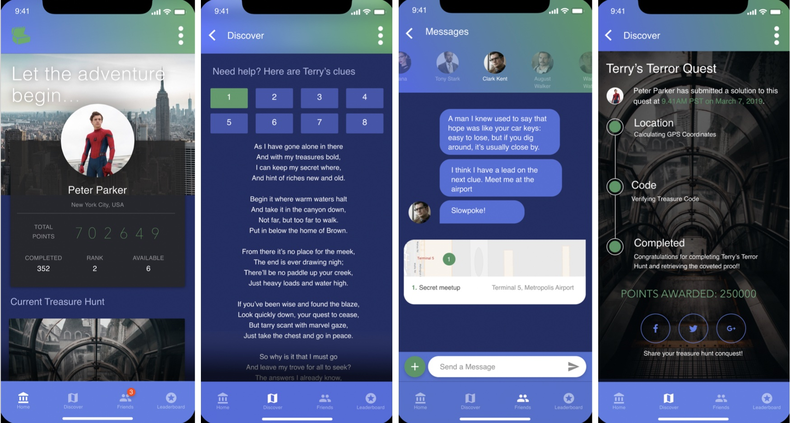

# Treasure Hunt
{: .fs-9 .no_toc}

A foray into the world of UX/UI mobile design with Adobe XD.
{: .fs-6 .fw-300 }

[Get started now](#project){: .btn .btn-primary .fs-5 .mb-4 .mb-md-0 .mr-2 } [View it on GitHub](https://xd.adobe.com/view/f1135a4f-0b98-4ea5-44d5-d6030aaeb56c-8722/?fullscreen){: .btn .fs-5 .mb-4 .mb-md-0 }

---

  

    Table of contents
  

  {: .text-delta }
1. TOC
{:toc}

## Project

This was my first foray into the world of UI/UX design and I have to say it was very rewarding. It was refreshing to approach the project from the design perspective and experiment with various tools such as Adobe XD to create a high fidelity mockup for a proposed mobile application.

  
## Project Details

There is nothing that ignites our inner imagination like the word treasure. Many people grow up watching, listening, and reading fantastic tales of treasure hunting expeditions which lead to unimaginable wealth or power. The real allure of these adventures tends to reside in the journey to the treasure rather than just the treasure itself. The proverbial “thrill of the hunt” keeps both treasure seekers and observers alike engaged by playing on the inquisitiveness and curiosity of human nature.

However, In a world that has become increasingly connected through technological advances, it may sometimes feel as if there are no treasures left to discover and no more swashbuckling adventures to be had. TreasureHunt aims to defeat this notion by bringing people of all ages together to adventure once again. This application creates a significant usability problem because it must find a way to capture the magic of a treasure hunting experience and deliver it as a mobile application. The feeling of wonder and excitement is a fragile one, though, and can easily be lost to frustration with unintuitive UI elements and feelings of inability to continue exploring. We will work with diverse users and iterate based on the surveys we create to ensure our user experience is not sullied or cut short by frustration.